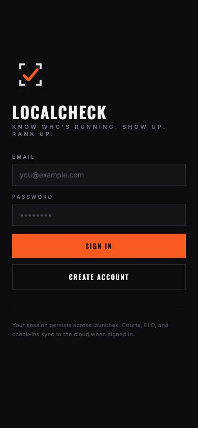
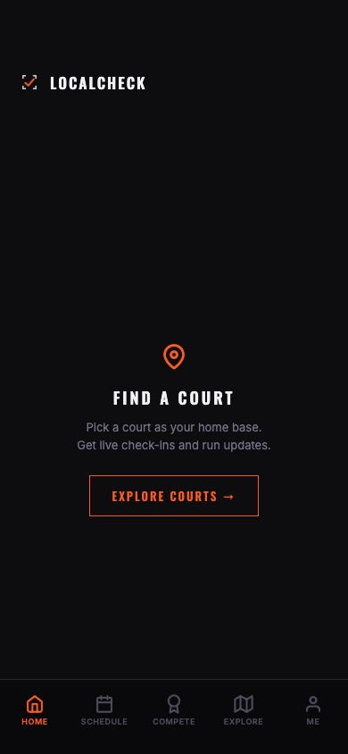
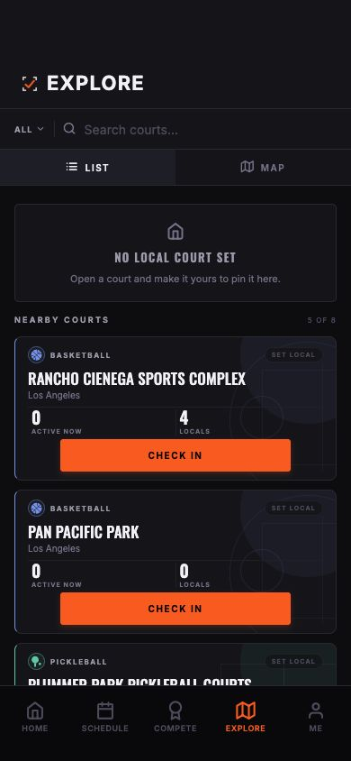
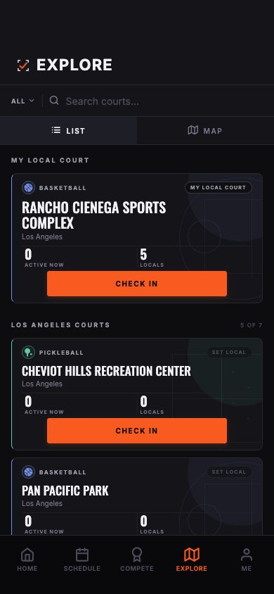
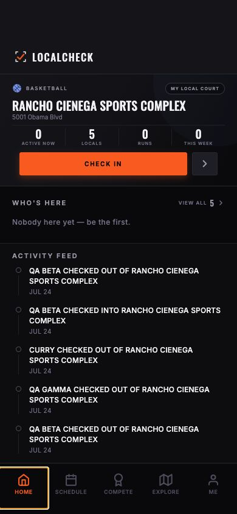
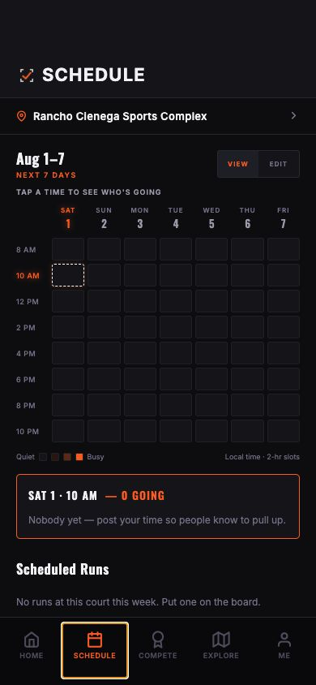
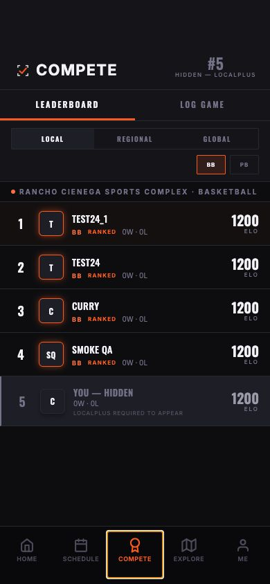
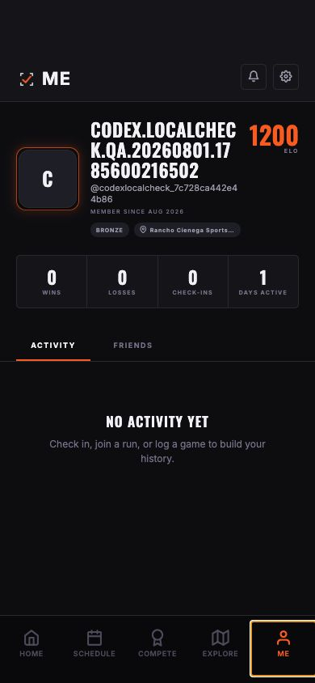
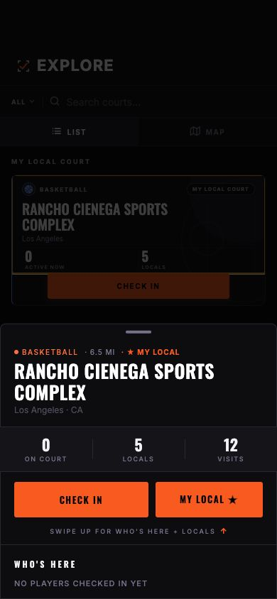

# LocalCheck current-build assessment — first-time user and design QA

Date: 2026-08-01, America/Chicago
Source assessed: GitHub `main` at `81ff0a4`
Physical checkpoint in project docs: TestFlight `1.0.1 (13)`, tag `v1.0.5`
Preview: interactive Expo web export at `390 × 844` in the Codex in-app browser

## Executive assessment

LocalCheck has a real product identity and a credible MVP shell. The court-first
Home, five-tab navigation, restrained orange action language, sport-aware court
cards, Schedule heatmap, Compete leaderboard, and contextual court sheet feel
like parts of one product rather than disconnected prototypes. The build is
fast, the hierarchy is generally legible, honest empty states are present, and
the local release gate passes.

The visual direction is stronger than the implementation system underneath it.
The build often looks like one product at a glance, but it does not yet behave
like one mature component system. Buttons, segmented controls, tabs, headers,
rows, empty states, feedback, spacing, touch targets, and type sizes are still
frequently composed screen by screen. That creates dozens of small differences
in otherwise similar interactions. A public user may not name those differences,
but they experience them as extra interpretation, reduced trust, and a product
that feels less finished than its brand promises.

The biggest journey gap is the missing first-run contract. Account creation
collects only email and password, then routes directly to Home. The system
silently turns the email prefix into a public display name and generates a long
username. There is no guided choice of name, sport, location, privacy, or local
court, and no profile-edit surface to repair the generated identity.

The current visual direction is worth keeping. LocalCheck does not need to be
made generic or redesigned from scratch. It needs a production-grade UI
foundation, a familiar first-use journey, and then a deliberate layer of
LocalCheck-specific delight.

| Area | Assessment | Why |
| --- | --- | --- |
| Visual identity | Strong | Distinctive dark editorial system, disciplined orange, coherent type and court identity |
| Navigation | Good | Familiar five-tab shell and strong court sheet; task order and secondary headers still drift |
| First-run clarity | Weak | No onboarding route or guided profile/local-court setup |
| Core information hierarchy | Good | Home and Explore answer useful court questions quickly; Schedule is denser |
| Interaction consistency | Mixed | Strong global patterns, but primary actions compete and web Pressables are semantically inconsistent |
| Trust and release readiness | Mixed | Build/checkpoint is functional; push, OTA safety, two-device proof, and backend-source drift remain |
| Accessibility readiness | Weak-to-mixed | Several good labels, but invalid nested buttons, generic controls, tiny text, and physical-device checks remain |

## Evidence and boundaries

- Refreshed `origin/main` before testing; `81ff0a4` is the current remote tip.
- Started the canonical `./script/start_local_preview.sh` path. Watchman is
  absent, so the documented export-and-serve fallback was used successfully.
- Created one QA account through the visible UI and set one local court. No
  check-in, schedule, run, friend, match, or notification action was submitted.
- Jesse was deliberately exercising Realtime during the walkthrough. That live
  activity is treated as intentional user input, not a defect and not final
  two-device acceptance evidence.
- `pnpm --filter @workspace/mobile run check:release` passed TypeScript and all
  five focused Realtime tests.
- Browser review covered Auth, first Home, Explore List, set-local flow, Home
  with a court, Schedule, Compete, Me, Settings, and the court sheet.
- Logout is already verified by Jesse on TestFlight and Expo Go. The two web
  preview attempts are excluded from the mobile defect and improvement lists.
- Native-only behavior—Apple Sign-In, APNs permission/registration, SecureStore,
  native Mapbox, iOS safe areas, keyboard/sheet behavior, and haptics—was not
  accepted from the web preview.
- Mobbin was requested for reference research, but its connector returned a
  paid-plan requirement. No Mobbin images were used or described.

## Production UI table-stakes audit

This separates standard public-app expectations from subjective visual taste.
`Native proof pending` means the design may be correct in code but was not
accepted on the TestFlight device in this pass. Delight never offsets a failed
production requirement.

| Public-app requirement | Status |
| --- | --- |
| User-controlled public identity | **Fail** |
| Complete account lifecycle and familiar auth | **Partial** |
| Location and privacy contract before discovery/check-in | **Fail** |
| Core live/social flows on two devices | **Native proof pending** |
| UI promises match backend/product truth | **Partial** |
| Accessibility and content resilience | **Fail / partial** |
| Native safe areas, Mapbox, keyboard, sheets and haptics | **Native proof pending** |
| Complete loading/success/error/offline action states | **Unproven** |
| First-session information architecture | **Partial** |
| Release/source-of-truth integrity | **Fail** |

| System | Current state | Production expectation | Priority |
| --- | --- | --- | --- |
| Navigation model | Familiar five-tab shell, but Explore—the first useful task—is fourth; secondary screens hand-roll headers | Task order matches the dominant journey; one back/header pattern; predictable sheet vs push behavior | P1 |
| Action hierarchy | Orange actions are visually strong, but `CHECK IN`, `SET LOCAL`, active filters, live state, rank, badges, and alerts compete for the same emphasis | One clear primary action per state; live status, selection, warning, and CTA remain distinguishable | P1 |
| Buttons and rows | Most interactions are direct `Pressable` compositions with different heights, radii, pressed states, labels, and semantics | Shared button, icon button, row, destructive row, chip, and inline-action primitives with explicit states | P1 |
| Forms | Auth combines two modes; inputs lack visibility/help/legal context; other forms build their own field and picker patterns | Familiar form modes, labels, validation timing, keyboard behavior, disabled/loading/success states, and recovery paths | P1 |
| Selection controls | Explore, Compete, Schedule, Me, and Settings each implement tab/segment/chip selection differently | One segmented/tab/chip language with selected, disabled, focus, and screen-reader states | P1 |
| Feedback | Some actions use haptics, some mutate silently, some use native alerts, and some show inline text | Every consequential action has immediate, consistent progress/success/error feedback and safe retry | P1 |
| Typography | Brand type is distinctive, but microcopy is routinely 6–10 px and all-caps/letter-spacing is overused | Minimum readable supporting text, Dynamic Type strategy, clear sentence-case body copy, stable truncation/wrapping | P1 |
| Touch and accessibility | Good labels exist in places; several visible controls are 28–38 pt and selection semantics are incomplete | 44×44 pt effective targets, roles/states/hints, logical focus order, VoiceOver labels, contrast and motion settings | P1 |
| Loading/empty/error states | Honest empty states exist, but their layout, CTA depth, and tone vary; loading is mostly generic spinners | Reusable state pattern that preserves context and always offers the next useful action | P2 |
| Motion and haptics | Court/Home interactions have thoughtful feedback; coverage is inconsistent | Motion explains hierarchy and state, haptics reinforce meaningful actions, reduced motion is honored | P2 |

## Implementation inconsistency inventory

### Component-system gaps

- **A shared button exists but is not the system.** `BrutalistButton` is used on
  only four detail surfaces, while the app and component folders contain 126
  direct `Pressable` compositions. Core Auth, Settings, Schedule, Compete, Me,
  Explore, and Home interactions still define their own button anatomy and
  pressed/disabled/loading behavior.
- **Headers are only partially canonical.** `ScreenHeader` is used by the five
  main tab surfaces, while Settings, Notifications, Friends, player, match, run,
  and court routes recreate top padding, back buttons, title sizes, and right
  actions. The result is a recognizable family, not one dependable pattern.
- **There is no canonical segmented control or tab primitive.** Explore
  List/Map correctly exposes tab roles and selected state; Me Activity/Friends,
  Compete scope, and Settings privacy/sport controls do not consistently expose
  equivalent semantics. Their heights, active treatments, type, and spacing
  also differ.
- **There is no shared settings/action row contract.** The push-notification
  row uses a disclosure chevron even though tapping it toggles a value. A native
  switch, checkbox, or clearly labeled action would match the result users
  expect from the control.
- **Spacing is locally authored.** There is a color/radius/type vocabulary but
  no spacing or control-height scale. Repeated gutters cluster around 16–24 px,
  yet internal gaps and vertical rhythm vary by one-off values across screens.
- **Shape language drifts.** The canonical radius scale is 2/3/5/8, but screens
  introduce hard-coded 7, 10, 12, 17, 24, 28, 50, 65, 75, 87, 105, and pill
  radii. Some values are geometrically necessary; others create visible drift
  between otherwise related cards, chips, avatars, and icon buttons.
- **Iconography is mixed without a role rule.** SF Symbols, Feather, and
  Material Community icons coexist. That is technically reasonable, but the
  app lacks a documented mapping for stroke weight, filled/selected state,
  optical size, or platform fallback. The Compete tab, for example, is a trophy
  on iOS and an award ribbon on the classic fallback.

### Typography and density gaps

- The published `FontSizes` scale starts at 11 px, but the current app and
  component folders contain 172 explicit 6–10 px declarations. Settings,
  Schedule, court metadata, profile chips, leaderboards, and map overlays rely
  on these sizes heavily.
- Uppercase display type is part of the brand; uppercase body instructions,
  status copy, labels, helper text, and compact metadata all at once flatten
  hierarchy and slow scanning. Keep Oswald/caps for identity and decisive
  labels; let explanations and recovery copy read naturally.
- Several important distinctions are encoded primarily through small type and
  subtle muted color. Outdoor use, glare, larger text settings, and lower-vision
  use have not been accepted on-device.
- Long content is treated inconsistently: court names sometimes wrap, sometimes
  truncate, and sometimes have fixed percentage widths; generated names can
  dominate Me; profile court pills cap at 132 px; usernames and activity text
  follow different overflow rules.

### Interaction and state gaps

- **Selected, disabled, unavailable, and locked are not distinct enough.** In
  Compete, Regional/Global look selectable but have unclear value; LocalPlus
  reads as exclusion; disabled buttons often rely on opacity alone.
- **Action confirmation varies.** Check-in has haptics and visible state,
  set-local relies on a badge mutation, filters change silently, and networked
  actions use a mix of spinners, alerts, or inline errors. A user should always
  know whether an action started, succeeded, failed, or can be retried.
- **Some familiar controls have unfamiliar outcomes.** The Settings push row
  looks like navigation but toggles in place; Schedule `VIEW`/`EDIT` changes
  mode without naming the user goal; an arrow-only court action opens details
  while the card itself can also open details.
- **Touch targets are inconsistent.** Examples include 28 px sport filters,
  30 px friend-request actions, 32–38 px icon/segment controls, and 27 px
  Schedule cells. `hitSlop` repairs a few icon buttons, but not as a system.
- **Accessibility semantics are uneven.** Explore List/Map is a good model.
  Other tab-like selectors omit roles/selected state; Auth actions do not use
  the shared button's semantics; the court card currently nests an interactive
  `SET LOCAL` action inside another interactive Pressable.
- **Loading and failure states do not preserve enough context.** Generic
  spinners appear across major surfaces; there is no shared skeleton or
  refresh/retry state that maintains the screen's spatial model.

### Information-architecture and language gaps

- Explore is the new user's first required destination but appears after Home,
  Schedule, and Compete in the tab bar. The order reflects the full product,
  not the first-session mental model.
- `Local`, `local court`, `home base`, `My Local Court`, `Locals`, and
  `LocalPlus` are distinct ideas with overlapping language. This is product
  vocabulary debt, not merely a copy edit.
- The app exposes Schedule, check-in presence, runs, games, Elo, friends,
  notifications, and privacy without a progressive disclosure model. New users
  encounter advanced or locked concepts before learning the core court loop.
- Some labels describe the interface (`VIEW`, `EDIT`, `REGIONAL`) rather than
  the user's intention (`SEE WHO'S GOING`, `ADD MY TIMES`, `EXPLORE CITY RANKS`).

## From production-ready to impressive

Table stakes should disappear into familiarity. Delight should come from the
court experience—not novelty in basic controls.

| Delight dimension | Current signal |
| --- | --- |
| Court identity and visual character | **Strong** |
| Contextual court sheet | **Strong, needs interaction cleanup** |
| First-session momentum and personalization | **Absent** |
| Meaningful live-court feedback | **Emerging** |
| Milestone celebration | **Absent** |
| Schedule direct manipulation | **Emerging** |
| Human, recognizable player identity | **Absent for new users** |

1. **Make the court feel alive.** Use a compact arrival pulse, changing crowd
   energy, friend-presence cues, and meaningful time-to-play information. Avoid
   decorative animation that does not improve a decision.
2. **Make first value nearly instant.** Let a user choose a sport and local
   court with rich previews, then land on a Home state that already feels
   personal. Explain privacy at the moment it matters.
3. **Turn presence into confidence.** Replace repetitive feed noise with a
   readable court story: building now, friends here, best arrival window, and
   runs that need one more player.
4. **Celebrate real milestones.** First local court, first check-in, first
   friend, first run, first verified result, and rank movement deserve restrained
   branded transitions and haptics. Never celebrate routine taps.
5. **Make identity feel earned, not generated.** A profile should quickly become
   recognizable through name, sport, court, reliability, and play history while
   keeping privacy obvious.
6. **Use the court visual language as the signature.** Court geometry, lighting,
   sport color, and live-state motion can distinguish LocalCheck. Standard
   navigation, forms, settings, and selection controls should remain familiar.

## First-time journey notes

### 1. Auth

What works:

- Strong brand entrance, clear email/password fields, obvious primary and
  secondary actions, and humanized auth errors.
- The create-account path succeeded and established a real session.

What does not:

- `SIGN IN` and `CREATE ACCOUNT` share one undifferentiated form. There is no
  clear mode, password requirement, show-password control, forgot-password
  route, or terms/privacy acknowledgement near account creation.
- The footer explains session persistence and cloud sync before explaining the
  user value or what happens next.
- Apple Sign-In is native-only and was not visible in the web preview, which is
  expected but leaves the browser QA path email-only.

### 2. First Home

What works:

- The empty state is focused and visually calm.
- `FIND A COURT` gives the first useful product task a clear CTA.

What does not:

- This screen is doing the work of onboarding without explaining why a local
  court matters, what is public, or whether the user can change it later.
- The account already has a public generated identity even though the user has
  never been shown or asked to approve it.

### 3. Explore and choose a local court

What works:

- List/Map is standard, search is obvious, cards communicate sport and useful
  counts, and the visual system gives each court a real identity.
- Setting a local court updates the card and Home without a reload.

What does not:

- On a first visit, the bright full-width `CHECK IN` action dominates the much
  smaller `SET LOCAL` control even though setting a home base is the task the
  previous screen asked the user to complete.
- When location is unavailable, the app silently falls back to Los Angeles.
  There is no inline explanation, permission rationale, or city-change path in
  the first-run sequence.
- `Local`, `local court`, `home base`, `My Local`, `Locals`, and `LocalPlus` are
  different concepts built from the same word. A new user has to learn the
  distinctions by inference.

### 4. Home with a local court

What works:

- Court identity, live metrics, check-in, roster, and community activity are
  immediately understandable.
- Only the activity feed scrolls; the key court context stays stable.
- Empty live presence is honest rather than padded with fabricated players.

What could improve:

- Repetitive historical check-in/check-out feed rows dominate the first full
  screen. Grouping or event deduplication would improve signal.
- `Locals` can be nonzero while `Who's here` is empty; that distinction is
  correct, but it needs a short first-use explanation.
- The arrow-only secondary court action depends on discovery. Give it a clear
  accessibility label everywhere and consider a short visible label on first use.

### 5. Schedule

What works:

- The selected court, rolling week, View/Edit modes, current-time default,
  density legend, selected-slot card, and run section form a coherent system.
- The screen is compact without horizontal overflow at the tested viewport.

What could improve:

- A new user first sees 56 mostly empty cells. The instruction says how to
  inspect a slot but does not explain the difference between viewing activity,
  posting availability, and creating a run.
- `VIEW`/`EDIT` is functional but abstract. `VIEW COURT` / `ADD MY TIMES`, or a
  short first-use coach mark, would reduce interpretation cost.
- The 7–9 px labels and dense grid require physical outdoor-legibility and
  Dynamic Type acceptance.

### 6. Compete

What works:

- The leaderboard is visually confident, scannable, and consistent with the
  rest of the app. Sport switching is compact and court context is explicit.

What does not:

- A brand-new player is introduced as `HIDDEN — LOCALPLUS` and
  `LOCALPLUS REQUIRED TO APPEAR` before LocalPlus has been explained or offered
  coherently. The first emotional message is exclusion, not progress.
- `REGIONAL` and `GLOBAL` appear disabled or unavailable without explanation.
- Product docs and the current UI imply sport-specific ratings, but the live
  schema still has only the combined `elo_rating` field. The client fallback
  prevents a crash, but the visual promise is ahead of the backend truth.

### 7. Me and Settings

What works:

- Stats, tier, court affiliation, Activity/Friends, notifications, and settings
  are organized into familiar areas.
- Empty activity gives useful next actions.

What does not:

- The QA email prefix became the public display name and wrapped across three
  lines. The generated username is long, opaque, and also public.
- There is no edit-profile surface for display name or username.
- The local-court chip truncates aggressively in the profile header.
- Settings renders `LOCALCHECK 1.0.0` while `app.json` is `1.0.1`.

### 8. Court sheet

What works:

- This is one of the strongest interactions in the app: recognizable bottom
  sheet behavior, stable court identity, clear metrics, strong primary actions,
  and an understandable path to deeper content.

What could improve:

- `CHECK IN` is visible on both the dimmed card and the sheet, increasing action
  duplication while the sheet is open.
- The sheet dependency emits React 19 `element.ref` warnings on web. It worked
  visually in this pass, but the warning should remain a tracked compatibility
  item.

## Verified technical and consistency findings

1. **Invalid nested buttons in court cards.** `CourtListItem` nests the
   `SET LOCAL` Pressable inside the card-opening Pressable. React reports a
   `<button>` inside `<button>` hydration error on web. This is invalid HTML,
   creates ambiguous interaction semantics, and is an accessibility problem.
2. **Generic or missing web roles.** Auth actions and several settings rows
   appeared as generic focusable elements, while Schedule cells and top-level
   tabs had useful accessible labels. Semantics are inconsistent rather than
   absent everywhere.
3. **React 19 sheet warnings.** Opening the court sheet logs repeated
   `element.ref` removal warnings. No visible failure occurred.
4. **Settings version drift.** UI says `1.0.0`; Expo config says `1.0.1`.
5. **Documentation drift.** At assessment start, README listed a nonexistent
   `/onboarding` route; `BACKEND_STATUS.md`, parts of product design docs, and
   environment wording conflicted with newer architecture/current-state
   sources. The README/current design/state/launch entry points were corrected
   in this pass; deeper archived/backend wording still needs deliberate cleanup.
6. **Production/backend source drift.** Live LocalCheckProd now has
   `notifications`, `push_tokens`, and `run_invitations`, the notification/run
   RPCs, and `profiles.push_notifications_enabled`. It does not have
   `elo_basketball` or `elo_pickleball`. The only deployed Edge Function found
   was `delete-account`; `send-notification` is not deployed. This partial live
   state is newer than `CURRENT_STATE.md` and is not represented by the reduced
   migration source on GitHub `main`.
7. **No PR-level GitHub Actions gate.** The repository has no GitHub Actions
   runs. Local checks and post-merge EAS workflows exist, but a pull request can
   merge without a GitHub-required typecheck/test signal.
8. **Add a Court presents false success.** Native and web maps expose a prominent
   add FAB. `AddCourtModal` calls an unproven `/api/courts/verify`, creates a
   client-generated `confirmed` court ID, calls the direct write, and closes.
   The documented live contract confirms `courts` is SELECT-only and has no
   `create_court` RPC, so this cannot truthfully persist in production.
9. **Edit Run is exposed without a valid write path.** Run Detail offers hosts
   an `EDIT RUN` form, but the live contract confirms `runs` is SELECT-only and
   has no update RPC. The UI should not offer an apparently working editor.
10. **Reduced motion is not respected.** `AnimatedEntry` always performs its
    scale/fade and `LivePulse` loops indefinitely; no reduced-motion branch or
    accessibility announcement was found.
11. **Fallback surfaces escape the brand system.** Auth/Add Court/Match include
    local color literals, the not-found route retains starter blue, and the root
    error fallback uses generic iOS blue/light styling rather than LocalCheck's
    recovery language and tokens.

## Scoped improvement backlog

### P0 — remove false affordances before public exposure

The assessed main build exported, loaded, signed up, navigated, and passed its
release gate. The known build-9 OTA/native crash was resolved by the `1.0.1`
runtime/native build and is not treated as current. Two prominent actions are,
however, knowingly offered without a production write path:

| Work item | Immediate safe scope | Full acceptance |
| --- | --- | --- |
| Add a Court | Hide the FAB or relabel it as an honest unavailable/suggest-a-court path; never show confirmed success from a client-only object | Moderated submission contract, authenticated RPC, verification service, failure/retry states, and production proof |
| Edit Run | Hide or disable the host editor with clear copy; keep valid cancel/join actions | Organizer-authorized update RPC, validation/conflict rules, dirty-form protection, error recovery, and two-client proof |

### P1 — complete before broader polish or App Store confidence

| Work item | Scope | Acceptance evidence |
| --- | --- | --- |
| Establish the production UI foundation | Canonical button/icon button, row, segmented control, tabs, chip/badge, field, header, empty/loading/error state, feedback API; spacing/type/control-height tokens | Core surfaces use the primitives; one visual/interaction contract per role; no screen-local substitute without a documented exception |
| Repair type and touch fundamentals | Replace 6–10 px essential copy, define Dynamic Type behavior, 44-point effective targets, contrast/reduced-motion rules, long-content fixtures | Outdoor/native review passes; accessibility-size text and long names/locales do not clip; target audit passes |
| Normalize familiar control behavior | Toggle controls look like toggles, disclosure rows navigate, tab/segment roles and selected states are explicit, one primary action per state | Sighted, keyboard, and VoiceOver users predict the result of each core control before activating it |
| Standardize action feedback and recovery | Pressed/loading/success/error/offline/retry/rollback behavior for check-in, set local, availability, friend, run, and notification writes | Every core write exposes progress and authoritative final state; failures preserve input and provide a safe next action |
| Build a real first-run flow | Display name, username availability, sport, location rationale/market, local court, privacy summary; skip only optional steps | Fresh account completes flow; public profile contains approved identity; resume works after interruption |
| Add profile editing | Display name, username, preferred sport, avatar if in scope | Changes persist on two clients and update Me/leaderboard/friends without relaunch |
| Fix court-card interaction semantics | Sibling action zones or one card button plus external `SET LOCAL`; no nested buttons | No hydration error; keyboard/VoiceOver can distinguish Open, Set Local, Check In |
| Respect accessibility preferences | Reduced-motion branch for entry/pulse/milestone motion; selective live announcements | Reduce Motion produces a stable equivalent UI; VoiceOver receives important async changes without chatter |
| Run build-13 two-device and native acceptance | Realtime both directions, background/foreground catch-up, Mapbox, safe areas, sheets, keyboard | Recorded iPhone evidence against build 13, not earlier build 9 |

### Parallel release-readiness track

These do not replace the UI work, but they remain required for a trustworthy
public build.

| Work item | Scope | Acceptance evidence |
| --- | --- | --- |
| Reconcile live backend and repo truth | Check in the exact reduced notification migration or replace it with one canonical migration; document deployed vs pending pieces | Migration list/schema/functions/Edge Functions match repository docs; no ambiguous partial state |
| Finish notification delivery truth | Root-cause build-13 token registration, deploy/authenticate sender if approved, configure webhook, retain inbox fallback | Two physical devices receive friend/run notification; retry/dedupe/error state recorded |
| Add OTA native-change guard | Prevent automatic OTA publication when native dependencies/config/runtime requirements change | A test native diff blocks OTA; JS-only diff publishes; runbook documents override path |
| Add PR quality gates | Typecheck, focused tests, and required check policy | A failing change cannot merge without an explicit, recorded override |

### P2 — screen-level usability and visual consistency

- Separate Sign In and Create Account states; add forgot password, password
  requirements, visibility control, and legal acknowledgement.
- Make `SET LOCAL` the first-run primary action and keep `CHECK IN` secondary
  until local-court context is established.
- Add lightweight first-use explanations for Local Court vs Locals, View vs
  Edit, check-in visibility, Elo, and LocalPlus.
- Do not lead a new player's Compete experience with `HIDDEN`. Show starter
  rank/progress honestly and explain LocalPlus where it is actionable.
- Generate the displayed app version from config rather than hard-coding it.
- Improve long-name/court-name behavior in Me and compact chips.
- Group or collapse repetitive activity-feed check-in/out pairs.
- Reconcile deeper backend/design/environment documents after their owning
  product and deployment contracts are approved.

| Surface | Scoped follow-up after the shared foundation |
| --- | --- |
| Auth | Distinct Sign In/Create Account modes; password reveal/rules/recovery; legal acknowledgement; branded but conventional field and error behavior |
| First Home | One sentence explaining the court loop and privacy; preserve the focused `FIND A COURT` action |
| Explore | First-run `SET LOCAL` hierarchy; explicit location/manual-market state; simplify duplicate card/detail actions; preserve List/Map semantics |
| Home | Collapse check-in/out churn into meaningful activity summaries; clarify Locals vs Here Now; keep court context stable |
| Court sheet | Remove duplicated live CTA behind the sheet; standardize detents, handle, gutter, title, and expanded-detail boundary |
| Schedule | Rename View/Edit around user goals; enlarge grid labels/targets; distinguish pending personal selections from group heat; preserve input on save failure |
| Compete | Welcome a new player with starter progress; explain or hide unavailable scopes; align Elo promise with stored data; introduce LocalPlus only where actionable |
| Me/Profile | Approved human identity, edit route, resilient long names and court chips, clearer single next action in empty Activity/Friends states |
| Friends/Notifications | Standard list rows, unread/request states, swipe or contextual actions only where platform-familiar, clear optimistic/error feedback |
| Settings | Use switches for toggles and chevrons for navigation; canonical section/row spacing; config-derived app version |
| System/fallback routes | Brand error/not-found/retry surfaces; remove starter colors and local literals; provide safe recovery/support copy |

### P3 — later product refinement

- Revisit regional/global leaderboard semantics only when real aggregation and
  privacy rules exist.
- Evolve Elo beyond the intentionally basic MVP only after confirmation/object
  flow and sport-specific storage are live and tested.
- Add motion polish after reduced-motion and native performance baselines are
  in place.

## Recommended execution sequence

1. Freeze a visual/component inventory and approve the production UI primitives,
   type ramp, spacing scale, control heights, icon rules, and action-state model.
2. Migrate one vertical slice—Auth → first Home → Explore → set local → Home—to
   the system while implementing approved identity and first-run onboarding.
3. Migrate Schedule, Compete, Me, Settings, and secondary routes; fix semantics,
   targets, state feedback, long content, and native presentation as each moves.
4. In parallel, reconcile backend/repo truth, protect OTA/CI delivery, and finish
   notification/two-device native acceptance.
5. Run screenshot, VoiceOver, Dynamic Type, reduced-motion, outdoor-legibility,
   and long-content acceptance across the same reference surfaces.
6. Add signature court-life motion, milestone feedback, and higher-order polish
   only after the standard controls are predictable and resilient.

## Design-skill research

No skills were installed. Recommended working stack:

| Skill | Current evidence | Use for LocalCheck |
| --- | --- | --- |
| [Expo `building-native-ui`](https://skills.sh/expo/skills/building-native-ui) | 58.8K installs; Expo source; 2,349 GitHub stars | Primary native UI, safe areas, sheets, controls, SF Symbols |
| [Vercel React Native Skills](https://skills.sh/vercel-labs/agent-skills/vercel-react-native-skills) | 178.2K installs; 29,666 stars | React Native performance, navigation, Pressable, lists, animation |
| [Impeccable](https://skills.sh/pbakaus/impeccable/impeccable) | 215.2K installs; 53,597 stars; reviewed local copy exists | Audit/critique/craft while preserving product and design contracts |
| [Emil Design Engineering](https://skills.sh/emilkowalski/skills/emil-design-eng) | 177.2K installs; 23,572 stars | Interaction timing, feedback, and micro-detail |
| [Anthropic Frontend Design](https://skills.sh/anthropics/skills/frontend-design) | 729K installs; 165,599 stars | General visual taste; use as inspiration, not mobile navigation authority |
| [iOS Mobile Design](https://skills.sh/wshobson/agents/mobile-ios-design) | 19.5K installs; 38,420 stars | HIG, safe areas, Dynamic Type, VoiceOver audit lens |
| [Imagegen Frontend Mobile](https://skills.sh/leonxlnx/taste-skill/imagegen-frontend-mobile) | 178.3K installs; 69,944 stars; installed locally | Alternative flow concept boards only, not implementation evidence |

Best combination: Impeccable audit + Expo native UI + Vercel React Native,
with Emil's skill for interaction depth. Hold `ui-ux-pro-max` despite popularity
because its listed trust audit failed. The requested custom `dev-6a…` plugin
exposed no callable capability in this session.

## Definition of done for the next assessment

- Fresh iPhone account can sign up, approve its identity, choose sport and local
  court, understand privacy, and reach a useful Home state without inference.
- The same user can edit identity later.
- Browser console has no nested-button/hydration errors on the core journey.
- App version, GitHub docs, migration sources, live schema, Edge Functions, and
  TestFlight checkpoint agree.
- Two physical clients prove friend notification and Realtime in both
  directions, including background/foreground recovery.
- The nine reference screenshots are regenerated at the same viewport and
  compared against this baseline.
