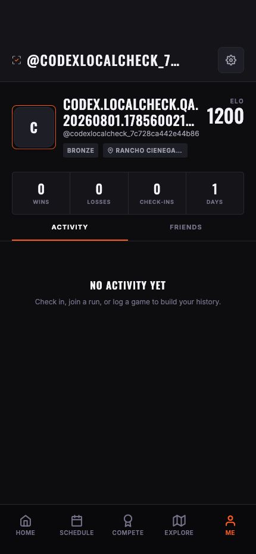
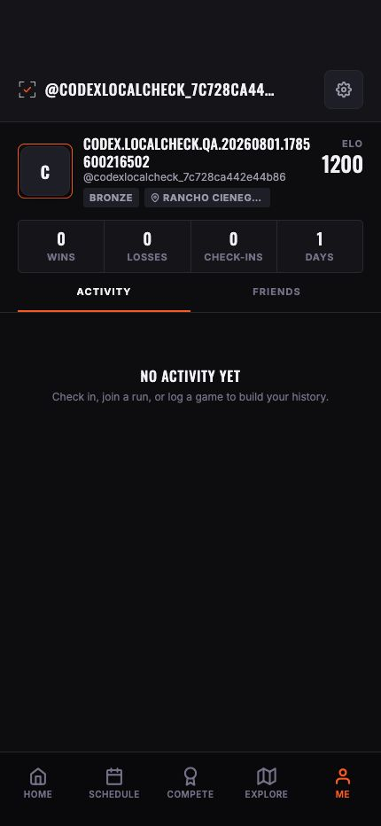

# Profile type-scale correction

Date: 2026-08-02
Viewport: 430 x 932
Surface: signed-in Me profile

## Evidence

### Before

The long handle and player name both used 23/27 display treatment, ELO used
32/35, the avatar was 68 points, and the four-stat row was 70 points high.
Compact identity data therefore occupied three competing headline zones.

### After

The dynamic header now uses 17/22, the player name 16/20, ELO 24/28, and stat
values 18/22. The avatar is 56 points and the stat row is 58 points high.
Supporting text follows 12/16 and labels follow 11/16.

## External benchmark

- [Material 3 typography](https://developer.android.com/develop/ui/compose/designsystems/material3)
  defines `titleMedium` at 16/24, `bodyMedium` at 14/20, `bodySmall` at 12/16,
  and `labelSmall` at 11/16.
- [Apple typography](https://developer.apple.com/design/human-interface-guidelines/typography)
  recommends a small set of consistent text styles whose hierarchy survives
  Dynamic Type changes.
- [Apple accessibility](https://developer.apple.com/design/human-interface-guidelines/accessibility/)
  identifies 17 points as the iOS default and 11 points as the recommended
  minimum for custom interface text.

## Decision

LocalCheck now exposes a semantic mobile scale in
`artifacts/mobile/constants/typography.ts`. This pass applies it to the shared
profile scaffold and Me-specific content. It does not claim that every existing
screen has been migrated yet.

## Evidence limits

The browser capture verifies hierarchy, fit, and same-viewport reflow. Physical
iPhone Dynamic Type, VoiceOver reading order, and maximum accessibility sizes
still require native acceptance testing.
